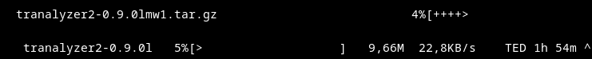
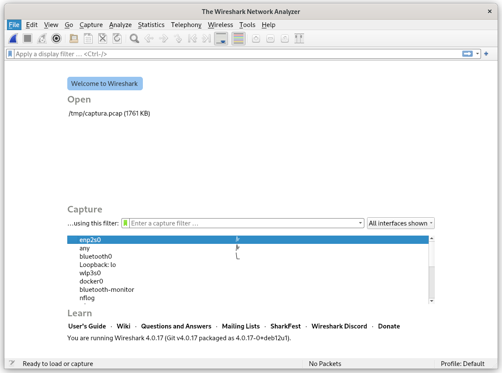
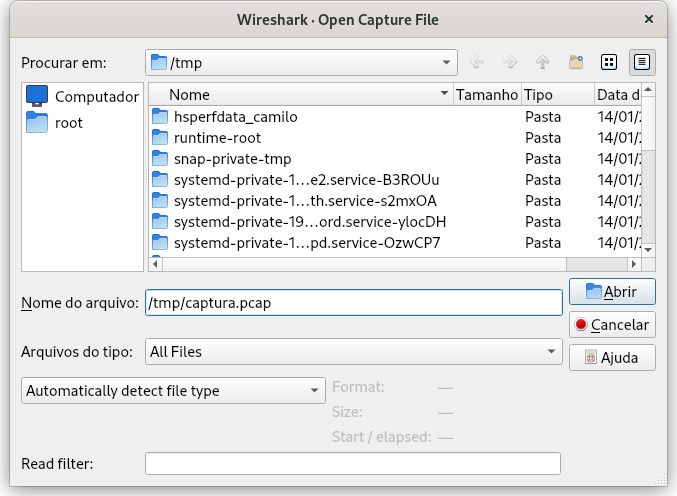
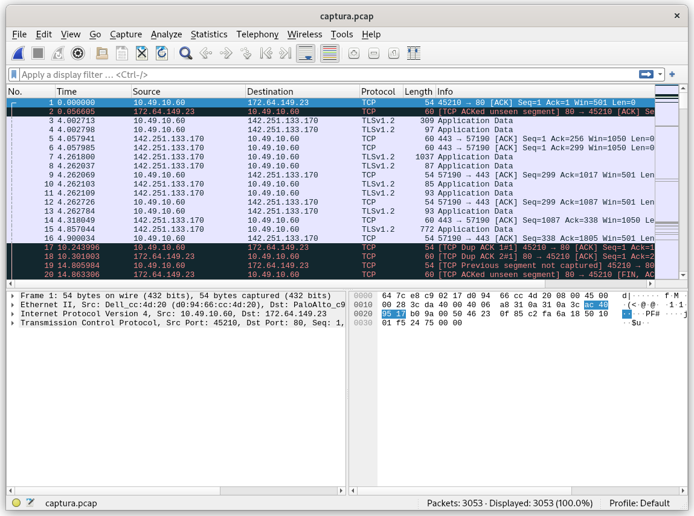
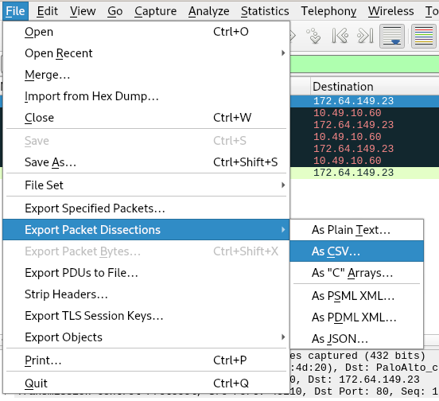
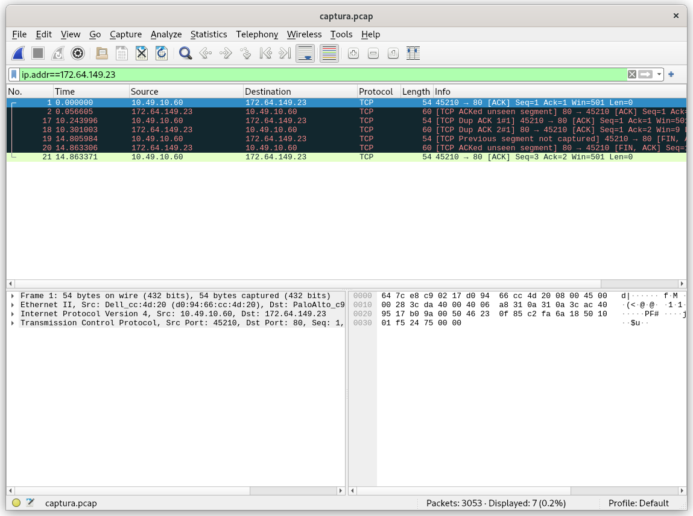

<!-- # Avaliação de Redes -->

# FLUXO DE COMANDOS APÓS MUDANÇA DAS INSTRUÇÕES

## Realizando captura
### Instalando TShark:
```sh
sudo apt-get update
sudo apt-get -y install tshark
```

Verificando após a instalação:
```sh
tshark --version
```
### Fazendo a captura:
Criando um arquivo para receber informações da captura:
```sh
touch captura_limitada.cap
chmod 666 captura_limitada.cap 
```

Realizando a captura limitando a 30.000 pacotes:
```sh
sudo tshark -i enp2s0 -w ./captura_limitada.cap -a filesize:30000
```

### Obter informações do arquivo de captura:
```sh
sudo capinfos ./captura_limitada.cap && ls -la ./captura_limitada.cap && uname -ompvn
```
OBS.: apenas para verificar se está correto.

### Exibindo informações no nível TCP:

Algumas informações de fluxo:
```sh
tshark -r ./captura_limitada.cap -Y tcp -T fields -e frame.time_relative -e ip.proto -e ip.src -e ip.dst -e tcp.srcport -e tcp.dstport
```

Tamanho do pacote e tempo entre chegadas em formato CSV:
```sh
tshark -r ./captura_limitada.cap -Y tcp -T fields -e frame.time_relative -e ip.proto -e ip.src -e ip.dst -e tcp.srcport -e tcp.dstport -e ip.len -e frame.time_delta -E separator=,
```

Pacotes que envolvem solicitação de conexão TCP:
```sh
tshark -r ./captura_limitada.cap -Y '(tcp && tcp.flags.syn==1 && tcp.flags.ack==0)' -T fields -e frame.number -e frame.time_relative -e ip.proto -e ip.src -e ip.dst -e tcp.srcport -e tcp.dstport -e ip.len -e frame.time_delta -E separator=,
```

Redirecionando a saída do comando a seguir para o arquivo "tcp.tmp":
```sh
tshark -r ./captura_limitada.cap -Y '(tcp && tcp.flags.syn==1 && tcp.flags.ack==0)' -T fields -e frame.number -e frame.time_relative -e ip.proto -e ip.src -e ip.dst -e tcp.srcport -e tcp.dstport -e ip.len -e frame.time_delta -E separator=, > ./tcp.tmp
```

Estatísicas do volume de dados em fluxo TCP:
```sh
tshark -r ./captura_limitada.cap -q -z 'conv,tcp,ip'
```

Filtrando as colunas a serem exibidas no comando acima (exibindo colunas 1, 3, 8 e 9):
```sh
tshark -r ./captura_limitada.cap -q -z 'conv,tcp,ip' | grep '<->' | awk '{ print $1 "," $3 "," $8 "," $9"," $11 }'
```

### Extraindo informações HTTP
Tráfego HTTP:
```sh
tshark -r ./captura_limitada.cap -Y 'tcp && (tcp.dstport==80 || tcp.dstport==443)' -T fields -e frame.number -e frame.time_relative -e ip.proto -e ip.src -e ip.dst -e tcp.srcport -e tcp.dstport -e ip.len -e frame.time_delta -E separator=\,
```

Domínios visitados:
```sh
tshark -r ./captura_limitada.cap -Y http.request -T fields -e http.host | sort -u
```

Domínios mais visitados (filtrado por quantidade n=10):
```sh
tshark -r ./captura_limitada.cap -Y http.request -T fields -e http.host | sort -u
```

Conexões HTTP inseguras (fitrado pela porta dstport==80):
```sh
for stream in $(tshark -nlr "./captura_limitada.cap" -Y '(tcp.flags.syn==1 && tcp.dstport==80)' -T fields -e tcp.stream | sort -n | uniq); 
    do echo "DADOS DO FLUXO $stream" ; tshark -nlr "./captura_limitada.cap" -q -z "follow,tcp,ascii,$stream";
done | more
```

Exemplo de saída:
```sh
DADOS DO FLUXO 12

===================================================================
Follow: tcp,ascii
Filter: tcp.stream eq 12
Node 0: 10.49.10.60:60274
Node 1: 23.212.191.102:80
431
POST / HTTP/1.1
Host: r10.o.lencr.org
User-Agent: Mozilla/5.0 (X11; Linux x86_64; rv:128.0) Gecko/20100101 Firefox/
[...]
```

## Análise dos dados recebidos
Instalação do tranalyzer:


<!-- ## Comandos para instalar ferramentas necessarias

Instalação das ferramentas necessárias para a avaliação:
```sh
sudo apt-get update
sudo apt-get -y install wireshark-common tshark tcpdump
```

Verificando a instalação:
```sh
wireshark --version
```

Esses pacotes não foram instalados:
```sh
tshark --version
tcpdump --version
```

Instalei individualmente:
```sh
sudo apt-get -y install tshark
sudo apt-get -y install tcpdump
```

Verificando após a segunda instalação:
```sh
tcpdump --version
tshark --version
```

Rodando esse comando apenas para garantir:
```sh
sudo apt -y --fix-broken install
```

## Comandos para realizar a captura

Comandos para verificar o tráfego tcp da placa ethernet:
```sh
sudo tcpdump -D
```

O comando abaixo exibe o trafego de rede da placa de rede 1:
```sh
sudo tcpdump -i 1 tcp
```

E equivalente ao comando a seguir:
```sh
sudo tcpdump -i enp2s0
```

Filtrar para trafego TCP:
```sh
sudo tcpdump -i enp2s0 tcp
```

Redirecionando a saida do comando para um arquivo:
```sh
sudo tcpdump -i enp2s0 tcp -w ./captura.pcap
```

Copiando o arquivo para uma pasta que qualquer um consegue ler o arquivo:
```sh
cp captura.pcap /tmp/
```

OBS.: não é necessário se for criado na pasta de aluno

Dando permissão de leitura:
```sh
chmod 444 /tmp/captura.pcap 
```

## Wireshark

Apos isso, e preciso abrir o wiresharkpara visualizar as informacoes do arquivo de captura:
```sh
wireshark
```
O programa sera aberto, apresentando a seguinte interface grafica:


No canto superior direito seleciona-se a opcao "File" e em seguida "Open" para abrir o arquivo. A interface abaixo sera aberta e o caminho do arquivo deve ser acessado/fornecido no campo de texto:


Ao abrir, serão apresentadas as capturas feitas pelo tcpdump:


Para pesquisar por um IP específico, eh preciso formular uma string de busca informando o IP desejado e inserir no campo de texto na parte superior da pagina:


## Exportacao e tratamento dos dados de captura

Por fim, para exportar os dados em formato .csv, sera necessario selecionar "File", "Export Packet Dissections" e "As CSV" como mostra a imagem abaixo:


Convertendo o campo tempo das capturas para o formato Epoch e apresentando o resultado no terminal:
```sh
tshark -r /tmp/captura.pcap -Y tcp -T fields -e frame.time_epoch
```

Redirecionando a saída para um arquivo de texto:
```sh
tshark -r /tmp/captura.pcap -Y tcp -T fields -e frame.time_epoch > /tmp/tempo
```

Exibir portas de origem das capturas:
```sh
tshark -r /tmp/captura.pcap -Y tcp -T fields -e tcp.srcport
```

Redirecionando a saída para umm arquivo de texto:
```sh
tshark -r /tmp/captura.pcap -Y tcp -T fields -e tcp.srcport > /tmp/porta_origem
```

## Adicionar campo tempo e porta de origem na captura exportada
Primeiramente movi/copiei os arquivos gerados no passo anterior para o diretório atual:
```sh
cp /tmp/porta_origem ./csv
cp /tmp/tempo ./csv
```
### Escrevendo script
Depois disso escrevi o seguinte [script](./script.py):
```py
with open("./csv/captura_exportada2.csv", "r") as input, open("./csv/tempo", "r") as f1, open("./csv/porta_origem", "r") as f2:
    input_lines = input.readlines()
    f1_lines = f1.readlines()
    f2_lines = f2.readlines()
with open("./csv/captura_alterada.csv", "w") as captura_alterada:
    for line1, line2, input_line in zip(f1_lines, f2_lines, input_lines):
        captura_alterada.write(f"{input_line.strip()}, {line1.strip()}, {line2.strip()}\n")
```

Esse script é responsável por ler três arquivos, o arquivo .csv com as informações da captura, o arquivo com o tempo criado anteriormente e o arquivo com as portas de origem também criados anteriormente. Após fazer a leitura desses arquivos e criar uma lista com as linhas, essas linhas são iteradas e escritas em um novo arquivo, "[captura_alterada](./csv/captura_alterada.csv)".

### Executando script
O script pode ser rodado com o seguinte comando:
```sh
python3 ./script.py 
``` -->