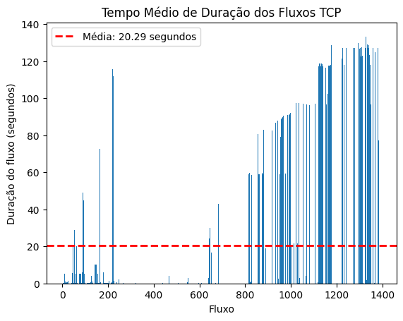
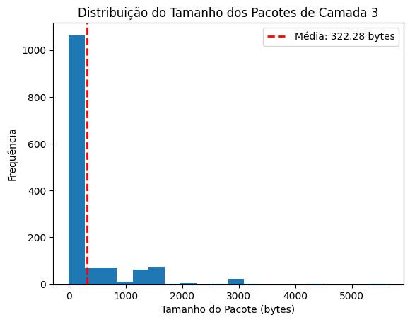
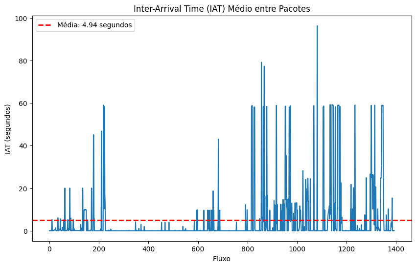

# Avaliação 2 - Aplicação de Redes de Computadores: Captura & Análise de Tráfego

## Realizando captura
Nesse capítulo serão comentados os passos realizados para obter um arquivo de captura de tráfego utilizando a ferramenta TShark.

### Instalando TShark:
```sh
sudo apt-get update
sudo apt-get -y install tshark
```

Verificando após a instalação:
```sh
tshark --version
```
### Fazendo a captura:
Criando um arquivo para receber informações da captura:
```sh
touch captura_limitada.cap
chmod 666 captura_limitada.cap 
```

Realizando a captura limitando a 30.000 pacotes:
```sh
sudo tshark -i enp2s0 -w ./captura_limitada.cap -a filesize:30000
```

### Obter informações do arquivo de captura:
```sh
sudo capinfos ./captura_limitada.cap && ls -la ./captura_limitada.cap && uname -ompvn
```
OBS.: apenas para verificar se está correto.

### Exibindo informações no nível TCP:

Algumas informações de fluxo:
```sh
tshark -r ./captura_limitada.cap -Y tcp -T fields -e frame.time_relative -e ip.proto -e ip.src -e ip.dst -e tcp.srcport -e tcp.dstport
```

Tamanho do pacote e tempo entre chegadas em formato CSV:
```sh
tshark -r ./captura_limitada.cap -Y tcp -T fields -e frame.time_relative -e ip.proto -e ip.src -e ip.dst -e tcp.srcport -e tcp.dstport -e ip.len -e frame.time_delta -E separator=,
```

Pacotes que envolvem solicitação de conexão TCP:
```sh
tshark -r ./captura_limitada.cap -Y '(tcp && tcp.flags.syn==1 && tcp.flags.ack==0)' -T fields -e frame.number -e frame.time_relative -e ip.proto -e ip.src -e ip.dst -e tcp.srcport -e tcp.dstport -e ip.len -e frame.time_delta -E separator=,
```

Redirecionando a saída do comando a seguir para o arquivo "tcp.tmp":
```sh
tshark -r ./captura_limitada.cap -Y '(tcp && tcp.flags.syn==1 && tcp.flags.ack==0)' -T fields -e frame.number -e frame.time_relative -e ip.proto -e ip.src -e ip.dst -e tcp.srcport -e tcp.dstport -e ip.len -e frame.time_delta -E separator=, > ./tcp.tmp
```

Estatísicas do volume de dados em fluxo TCP:
```sh
tshark -r ./captura_limitada.cap -q -z 'conv,tcp,ip'
```

Filtrando as colunas a serem exibidas no comando acima (exibindo colunas 1, 3, 8 e 9):
```sh
tshark -r ./captura_limitada.cap -q -z 'conv,tcp,ip' | grep '<->' | awk '{ print $1 "," $3 "," $8 "," $9"," $11 }'
```

### Extraindo informações HTTP
Tráfego HTTP:
```sh
tshark -r ./captura_limitada.cap -Y 'tcp && (tcp.dstport==80 || tcp.dstport==443)' -T fields -e frame.number -e frame.time_relative -e ip.proto -e ip.src -e ip.dst -e tcp.srcport -e tcp.dstport -e ip.len -e frame.time_delta -E separator=\,
```

Domínios visitados:
```sh
tshark -r ./captura_limitada.cap -Y http.request -T fields -e http.host | sort -u
```

Domínios mais visitados (filtrado por quantidade n=10):
```sh
tshark -r ./captura_limitada.cap -Y http.request -T fields -e http.host | sort -u
```

Conexões HTTP inseguras (fitrado pela porta dstport==80):
```sh
for stream in $(tshark -nlr "./captura_limitada.cap" -Y '(tcp.flags.syn==1 && tcp.dstport==80)' -T fields -e tcp.stream | sort -n | uniq); 
    do echo "DADOS DO FLUXO $stream" ; tshark -nlr "./captura_limitada.cap" -q -z "follow,tcp,ascii,$stream";
done | more
```

Exemplo de saída:
```sh
DADOS DO FLUXO 12

===================================================================
Follow: tcp,ascii
Filter: tcp.stream eq 12
Node 0: 10.49.10.60:60274
Node 1: 23.212.191.102:80
431
POST / HTTP/1.1
Host: r10.o.lencr.org
User-Agent: Mozilla/5.0 (X11; Linux x86_64; rv:128.0) Gecko/20100101 Firefox/
[...]
```

## Refinamento dos dados recebidos
Após a obtenção da captura, foi utilizada a ferramenta Tranalyzer2 para extrair informações relevantes, que posteriormmente seriam utilizadas na análise dos dados coletados.

### Instalação do Tranalyzer2:
Passo a passo para instalação:
```sh
wget https://tranalyzer.com/download/tranalyzer/tranalyzer2-0.9.0lmw1.tar.gz
tar xzf tranalyzer2-0.9.0lmw1.tar.gz tranalyzer2-0.9.0/ls
cd tranalyzer2-0.9.0/
./setup.sh 
source ~/.bashrc
```

Verificando após a instalação:
```sh
t2 --version
```

### Tratando dados com Tranalyzer:
Para tratar os dados utilizando o Tranalyzer, é necessário utilizar o comando baixo:
```sh
t2 -r ./captura_limitada.cap -w ./resultados/results
```

### Exibindo colunas desejadas no terminal
Verificando o conteúdo do arquivo [results_headers.txt](./resultados/results_headers.txt), é possível verificar as existentes no arquivo de capture e informações correspondentes a elas:
```sh
cat ./resultados/results_headers.txt
```

Exemplo de saída:
```sh
# Date: 1737652709.850808 sec (Thu 23 Jan 2025 14:18:29 -03)
# Tranalyzer 0.9.0 (Anteater), Cobra
# Core configuration: L2, IPv4, IPv6
# SensorID: 666
# PID: 21566
[...]
# Plugins loaded:
#   01: protoStats, version 0.9.0
#   02: basicFlow, version 0.9.0
#   03: macRecorder, version 0.9.0
#   04: portClassifier, version 0.9.0
#   05: basicStats, version 0.9.0
[...]
# Col No.       Type    Name    Description
1       C       dir     Flow direction
2       U64     flowInd Flow index
3       H64     flowStat        Flow status and warnings
4       U64.U32 timeFirst       Date time of first packet
5       U64.U32 timeLast        Date time of last packet
```
Sabendo disso, é possível selecionar algumas colunas relevantes para serem extraídas, como as dispostas na tabela abaixo:

| Informação                                     | Nome do Campo      | Número da Coluna |
|------------------------------------------------|--------------------|------------------|
| Duração do Fluxo                               | duration           | 6                |
| Tamanho médio do pacote na camada 3            | avePktSize         | 35               |
| Desvio padrão do tamanho do pacote na camada 3 | stdPktSize         | 36               |
| Tempo médio entre chegadas (IAT)               | aveIAT             | 39               |
| Contagem de sequência de pacotes TCP           | tcpPSeqCnt         | 58               |
| Tamanho médio efetivo da janela TCP            | tcpAveWinSz        | 66               |
| Média de viagem de ACK TCP                     | tcpRTTAckTripAve   | 92               |

Utilizando o comando tawk para visualizar colunas selecionadas:
```sh
tawk -F" " '{print $6, $35, $36, $39, $58, $66, $92}' ./resultados/results_flows.txt
```

<!-- 
| Informação                             | Nome do campo      | Número da Coluna |
|----------------------------------------|--------------------|------------------|
| Flow Duration                          | duration           | 6                |
| Average layer 3 packet size            | avePktSize         | 35               |
| Standard deviation layer 3 packet size | stdPktSize         | 36               |
| Average IAT (Inter-Arrival Time)       | aveIAT             | 39               |
| TCP packet seq count                   | tcpPSeqCnt         | 58               |
| TCP average effective window size      | tcpAveWinSz        | 66               |
| TCP ACK trip average                   | tcpRTTAckTripAve   | 92               |
-->

### Extraindo colunas desejadas e inserindo em um arquivo
Redirecionando a saída do comando acima para o arquivo [colunas_extraidas.csv](./colunas_extraidas.csv):

```sh
tawk -F" " '{print $6, $35, $36, $39, $58, $66, $92}' ./resultados/results_flows.txt > colunas_extraidas.csv
```

## Elaboração do relatório
Elabore um relatório e inclua textos e gráficos para responder às seguintes perguntas. Confeccione um relatório demonstrando em texto e gráficos, com o objetivo de responder os seguintes quesitos:

### a) Qual o tempo médio de duração de um fluxo
...

### b) Qual o tamanho médio de um pacote da camada 3
...

### c) Qual o desvio padrão do tamanho de um pacote de camada 3
...

### d) Qual o inter-arrival time (IAT) - O tempo entre chegadas - de cada pacote
...

### e) No contador de sequência dos números de pacotes há algum tempo com “0”, por que isso ocorre?
...

### f) Qual a média do tempo de viagem (RTT - Round Trip Time) da flag ACK no TCP
...

# Escrita do relatório

## 1 INTRODUÇÃO

## 2 METODOLOGIA

Nesta seção, descreva os passos realizados durante a captura e análise:

Ferramentas utilizadas: 
- Máquina utilizada para captura
- Máquina utilizada para análise
- Tshark
- Tranalyzer
- Visual Studio Code
- Jupyter Notebooks

Configuração inicial:
- Identificação da interface de rede para captura.
- Ajuste das permissões para execução do Tshark.

Captura de pacotes:
- Comando utilizado para capturar os pacotes TCP: tshark -i <interface> -w captura.pcap -c 30000
- Abertura de várias páginas de sites HTTP e HTTPS para gerar tráfego.

Análise de pacotes:
- Extração de dados TCP e HTTP usando comandos específicos.
- Processamento dos fluxos no Tranalyzer.

## 3. RESULTADOS

### 3.1 Métricas de Fluxos TCP
- Preencha os dados obtidos no Tranalyzer:
- Tempo médio de duração de um fluxo: [resultado]
- Tamanho médio dos pacotes de camada 3: [resultado]
- Desvio padrão do tamanho dos pacotes: [resultado]
- Inter-Arrival Time (IAT) médio: [resultado]
- Média de RTT da flag ACK no TCP: [resultado]

```py
# 6	U64.U32	duration	Flow duration
tempo_medio_duracao = df['duration'].mean()
# 35	F	avePktSize	Average layer 3 packet size
tamanho_medio_pacotes = df['avePktSize'].mean()
# 36	F	stdPktSize	Standard deviation layer 3 packet size
desvio_padrao_pacotes = df['stdPktSize'].mean()
# 39	F	aveIAT	Average IAT
iat_medio = df['aveIAT'].mean()
# 92	F	tcpRTTAckTripAve	TCP ACK trip average
rtt_medio = df['tcpRTTAckTripAve'].mean()

print(f"Tempo médio de duração de um fluxo: {tempo_medio_duracao:.2f} segundos")
print(f"Tamanho médio dos pacotes de camada 3: {tamanho_medio_pacotes:.2f} bytes")
print(f"Desvio padrão do tamanho dos pacotes: {desvio_padrao_pacotes:.2f} bytes")
print(f"Inter-Arrival Time (IAT) médio: {iat_medio:.2f} segundos")
print(f"Média de RTT da flag ACK no TCP: {rtt_medio:.2f} segundos")
```

Saída:
```
Tempo médio de duração de um fluxo: 20.29 segundos
Tamanho médio dos pacotes de camada 3: 322.28 bytes
Desvio padrão do tamanho dos pacotes: 213.70 bytes
Inter-Arrival Time (IAT) médio: 4.94 segundos
Média de RTT da flag ACK no TCP: 2.25 segundos
```

### 3.2 Análise de Pacotes HTTP
Apresente as informações extraídas:
Domínios visitados:
- [Domínio 1]
- [Domínio 2]
- [Outros...]

Quantidade de solicitações HTTP (porta 80):
- [resultado]

Quantidade de solicitações HTTPS (porta 443):
- [resultado]

Quantidade de visitas por domínio:
<div>
<style scoped>
    .dataframe tbody tr th:only-of-type {
        vertical-align: middle;
    }

    .dataframe tbody tr th {
        vertical-align: top;
    }

    .dataframe thead th {
        text-align: right;
    }
</style>
<table border="1" class="dataframe">
  <thead>
    <tr style="text-align: right;">
      <th></th>
      <th>Endereço de destino</th>
      <th>Domínio</th>
      <th>Visitas</th>
    </tr>
  </thead>
  <tbody>
    <tr>
      <th>1</th>
      <td>10.49.10.60</td>
      <td></td>
      <td>480</td>
    </tr>
    <tr>
      <th>2</th>
      <td>10.54.0.155</td>
      <td></td>
      <td>352</td>
    </tr>
    <tr>
      <th>3</th>
      <td>224.0.0.22</td>
      <td></td>
      <td>72</td>
    </tr>
    <tr>
      <th>4</th>
      <td>04</td>
      <td></td>
      <td>68</td>
    </tr>
    <tr>
      <th>5</th>
      <td>10</td>
      <td></td>
      <td>44</td>
    </tr>
  </tbody>
</table>
</div>

Quantidade de solicitações por porta:
<div>
<style scoped>
    .dataframe tbody tr th:only-of-type {
        vertical-align: middle;
    }

    .dataframe tbody tr th {
        vertical-align: top;
    }

    .dataframe thead th {
        text-align: right;
    }
</style>
<table border="1" class="dataframe">
  <thead>
    <tr style="text-align: right;">
      <th></th>
      <th>Porta</th>
      <th>Solicitações</th>
    </tr>
  </thead>
  <tbody>
    <tr>
      <th>1</th>
      <td>53</td>
      <td>352</td>
    </tr>
    <tr>
      <th>2</th>
      <td>443</td>
      <td>119</td>
    </tr>
    <tr>
      <th>3</th>
      <td>0</td>
      <td>74</td>
    </tr>
    <tr>
      <th>4</th>
      <td>10.49.10.60</td>
      <td>68</td>
    </tr>
    <tr>
      <th>5</th>
      <td>addresses"</td>
      <td>32</td>
    </tr>
  </tbody>
</table>
</div>

### 3.3 Gráficos
Inclua gráficos gerados a partir das métricas:
- Gráfico de barras para o tempo médio de duração dos fluxos.
- Histograma para o tamanho dos pacotes de camada 3.
- Gráfico de linha para representar o IAT médio entre pacotes.

#### Gráfico de barras para o tempo médio de duração dos fluxos.


#### Histograma para o tamanho dos pacotes de camada 3.


Tabela ampla:
<div>
<style scoped>
    .dataframe tbody tr th:only-of-type {
        vertical-align: middle;
    }

    .dataframe tbody tr th {
        vertical-align: top;
    }

    .dataframe thead th {
        text-align: right;
    }
</style>
<table border="1" class="dataframe">
  <thead>
    <tr style="text-align: right;">
      <th>Tamanho do pacote de camada 3</th>
      <th>Frequência</th>
    </tr>
  </thead>
  <tbody>
    <tr>
      <td>&lt; 1000</td>
      <td>1213</td>
    </tr>
    <tr>
      <td>1000-2000</td>
      <td>145</td>
    </tr>
    <tr>
      <td>2000-3000</td>
      <td>30</td>
    </tr>
    <tr>
      <td>3000-4000</td>
      <td>3</td>
    </tr>
    <tr>
      <td>&gt; 4000</td>
      <td>2</td>
    </tr>
  </tbody>
</table>
</div>

Tabela detalhada:
<div>
<style scoped>
    .dataframe tbody tr th:only-of-type {
        vertical-align: middle;
    }

    .dataframe tbody tr th {
        vertical-align: top;
    }

    .dataframe thead th {
        text-align: right;
    }
</style>
<table border="1" class="dataframe">
  <thead>
    <tr style="text-align: right;">
      <th>Tamanho do pacote de camada 3</th>
      <th>Frequência</th>
    </tr>
  </thead>
  <tbody>
    <tr>
      <td>0-200</td>
      <td>1033</td>
    </tr>
    <tr>
      <td>200-400</td>
      <td>85</td>
    </tr>
    <tr>
      <td>400-600</td>
      <td>18</td>
    </tr>
    <tr>
      <td>600-800</td>
      <td>70</td>
    </tr>
    <tr>
      <td>800-1000</td>
      <td>7</td>
    </tr>
  </tbody>
</table>
</div>

#### Gráfico de linha para representar o IAT médio entre pacotes.


## 4 DISCUSSÃO
Responda às questões propostas na atividade:
- Por que há tempos com "0" no contador de sequência TCP?
    - Resposta: [Explique brevemente o motivo técnico.]
- O que os dados analisados indicam sobre a qualidade da conexão entre as redes? 
    - Resposta: [Discuta com base nos valores de RTT, tamanho dos pacotes e IAT]

Momento final do trabalho em que o autor apresenta suas conclusões correspondentes aos objetivos.

## 5 CONCLUSÃO
Resuma os resultados da atividade, destacando:
- A eficiência do uso do Tshark e do Tranalyzer para a análise de tráfego.
- A importância de entender as métricas TCP e HTTP para o diagnóstico de redes.
